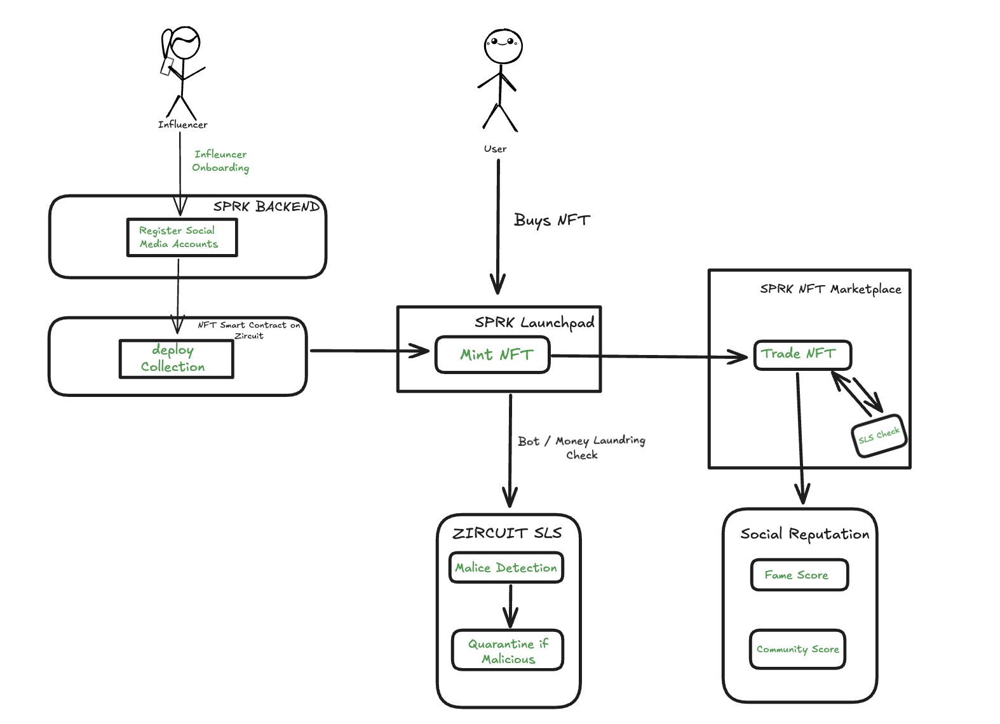
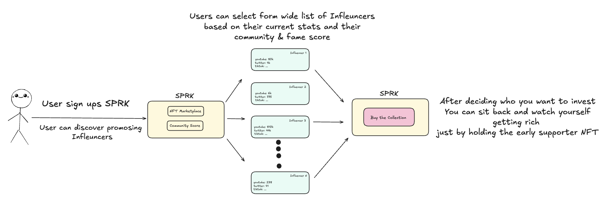
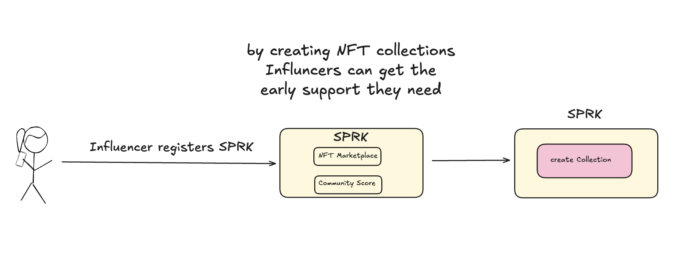

## SPRK — Early Influencer Investment on Zircuit

SPRK is an influencer-focused NFT Launchpad and Marketplace built on Zircuit, empowering early supporters to invest in rising creators while leveraging Sequencer-Level Security (SLS) to block bots, spam, and manipulation.

___

## What is SPRK?

Emerging influencers need more than just social visibility — they need financial and community support. Yet today, fans have no trusted way to back rising talent transparently, while avoiding bots, fake hype, and exploit risks.

SPRK fixes this by letting users discover and invest early in creators through secure NFT launches, reputation tracking, and a social layer — all powered by Zircuit's SLS.

___

## Solution: Early Access Meets Zircuit Security

SPRK enables early influencer investment through NFT launches and a social reputation system — with Zircuit's SLS providing invisible protection.

- Supporters invest via limited NFTs tied to influencer growth
- NFT value reflects popularity, creating organic FOMO
- Real-time reputation scores for social transparency
- Zircuit SLS quarantines bots, exploits, and malicious activity before block inclusion

___

## Core Features

- Early Access to Future Influencers
- Limited NFT Launches with Social Layer
- Reputation System — Fame Score & Community Score
- SLS-Powered Bot, Spam, and Money Laundering Protection
- Marketplace for Trading
- Censorship Awareness on Transactions

___


## Architecture Diagrams



The diagram above represents the full technical flow of SPARK, showing how each component interacts across backend, smart contracts, and Zircuit infrastructure:

⸻

🎛️ SPRK Backend
	•	Handles influencer onboarding and social media verification
	•	Prevents fake profiles by validating off-chain credentials
	•	After verification, enables NFT smart contract deployment

Tech: Node.js, Express (future), off-chain API calls

⸻

🔗 Smart Contract Layer (On Zircuit)
	•	Influencers deploy ERC-721 contracts to Zircuit Testnet
	•	Supporter mints trigger on-chain contract functions
	•	Marketplace operates fully on-chain for secondary trades

Tech: Solidity, Hardhat, OpenZeppelin standards

⸻

🛡️ Zircuit Infrastructure
	•	All transactions (mint & trade) flow through Zircuit’s Sequencer
	•	SLS (Sequencer-Level Security) applies:
→ Transaction simulation
→ AI & rule-based malice detection
→ Quarantine of suspicious transactions before block inclusion

Provides protection against bots, money laundering, and exploits transparently

⸻

🖥️ Frontend (User Interface)
	•	Built with Next.js and React
	•	Integrates MetaMask & ethers.js for direct contract interaction
	•	Shows reputation metrics and transaction feedback in real-time


## 👥 User & Influencer Flow

SPRK creates two distinct, but connected experiences for the ecosystem:

### 🚀 For Supporters (Users)
Everyday users can:

1. Discover emerging influencers on the platform  
2. Invest early by minting limited supporter NFTs  
3. Trade NFTs on the marketplace as influencer popularity grows and make profit  
4. Monitor their impact and social reputation via transparent Fame & Community Scores  
5. Rely on Zircuit's SLS to ensure their transactions are protected from bots, spam, and manipulation  

This flow enables fans to gain early access, while building social credibility and benefiting from influencer growth.

**User Flow Diagram:**  


---

### 🎤 For Influencers (Creators)
Rising creators can:

1. Onboard to the platform by connecting social media accounts and their wallets
2. Deploy their own NFT collection directly on Zircuit  
3. Build community through exclusive content or perks for NFT holders  
4. Track their growth and credibility through real-time reputation metrics  
5. Leverage SPRK's security-first infrastructure to avoid exploitation, fake hype, or bot attacks  

This gives influencers early financial and community support, with manipulation-resistant growth.

**Influencer Flow Diagram:**  
 


___

## Tech Stack we used and are planning to use

- **Frontend:** Next.js, React
- **Smart Contracts:** Solidity, Hardhat, OpenZeppelin
- **Blockchain:** Zircuit Garfield Testnet
- **Wallet Integration:** ethers.js, MetaMask
- **Storage:** IPFS
- **RPC:** Alchemy, Zircuit RPC

___

## Market & Future Development

- No scalable, security-focused influencer NFT platform exists today
- SPRK fills this gap with early access, real reputation, and exploit protection

Next:

• Soulbound NFTs for supporter perks
• Special contents for NFT Holders. 
• Fully on-chain influencer discovery
• Zircuit Mainnet deployment
• Dynamic community-driven reputation

___


## 🚀 Getting Started

1. Clone the Repository
```bash
git clone https://github.com/kerem6790/SPRK.git
cd SPRK
```

2. Install Dependencies
```bash
cd frontend
npm install
```

3. Set Up Environment Variables
Create a frontend/.env.local file and add the following:
```env
NEXT_PUBLIC_CONTRACT_ADDRESS=0x2fcac62065dedC7765Fa06c68f4E883EB118B31c
NEXT_PUBLIC_NETWORK_NAME=Zircuit Garfield Testnet
NEXT_PUBLIC_RPC_URL=https://garfield-testnet.zircuit.com/
NEXT_PUBLIC_CHAIN_ID=48898
NEXT_PUBLIC_EXPLORER_URL=https://explorer.garfield-testnet.zircuit.com/
```

4. Start the Frontend
```bash
npm run dev
```
The app will be running at http://localhost:3000


Built at EthGlobal Cannes 2025

