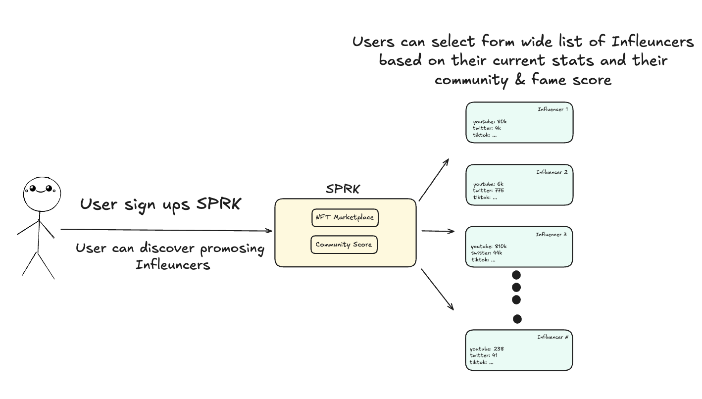

## SPRK — Early Influencer Investment on Zircuit

SPRK is an influencer-focused NFT Launchpad and Marketplace built on Zircuit, empowering early supporters to invest in rising creators while leveraging Sequencer-Level Security (SLS) to block bots, spam, and manipulation.

___

## What is SPRK?

Emerging influencers need more than just social visibility — they need financial and community support. Yet today, fans have no trusted way to back rising talent transparently, while avoiding bots, fake hype, and exploit risks.

SPRK fixes this by letting users discover and invest early in creators through secure NFT launches, reputation tracking, and a social layer — all powered by Zircuit's SLS.

___

## Solution: Early Access Meets Zircuit Security

The core problem today about SocialFi and investing into influencers is that, these kind of project turn int ponzy schemes real quick and are not sustainable. We don't want that.

Our solution offers an NFT based support for early stage creators. Users can buy the 
NFT collections of influencers who they believe have potential. Early supporter NFT's will 
be cheaper and more rare. 

Thanks to NFT's and not just tokenizing influencers, the system will be sustainable.

Holding NFT's will have perks as well. In future, we are planning to add special content
feature, NFT holders are going to be able to watch special contents and interact with them. 

Infuencers are obviosly going to benefit from this too. By getting the early support they need, it is going to be much easier for them to be seen and get popular. 

We believe this solution is a win-win system and has a lot of potential. By combining all above with Zircuit's ai powered sequencer level security, our system is going to be safe of bots and hacks. 
___

## Core Features

- Early Access to Future Influencers
- Limited NFT Launches with Social Layer
- Reputation System — Fame Score & Community Score
- SLS-Powered Bot, Spam, and Money Laundering Protection
- Marketplace for Trading
- Censorship Awareness on Transactions

___


### Architecture Diagrams


The diagram above represents the full technical flow of SPARK, showing how each component interacts across backend, smart contracts, and Zircuit infrastructure:

___

### SPRK Backend
-	Handles influencer onboarding and social media verification
-	Prevents fake profiles by validating off-chain credentials
-	After verification, enables NFT smart contract deployment

Tech: Node.js, Express (future), off-chain API calls

___

### Smart Contract Layer (On Zircuit)
-	Influencers deploy ERC-721 contracts to Zircuit Testnet
-	Supporter mints trigger on-chain contract functions
-	Marketplace operates fully on-chain for secondary trades

Tech: Solidity, Hardhat, OpenZeppelin standards

___

### Zircuit Infrastructure
-	All transactions (mint & trade) flow through Zircuit’s Sequencer
-	SLS (Sequencer-Level Security) applies:
- Transaction simulation
- AI & rule-based malice detection
- Quarantine of suspicious transactions before block inclusion

Provides protection against bots, money laundering, and exploits transparently

___

### Frontend (User Interface)
-	Built with Next.js and React
-	Integrates MetaMask & ethers.js for direct contract interaction
-	Shows reputation metrics and transaction feedback in real-time


## 👥 User & Influencer Flow

**User Flow Diagram:**  


SPRK creates two distinct, but connected experiences for the ecosystem:

### 🚀 For Supporters (Users)
Everyday users can:

1. Discover emerging influencers on the platform  
2. Invest early by minting limited supporter NFTs  
3. Trade NFTs on the marketplace as influencer popularity grows and make profit  
4. Monitor their impact and social reputation via transparent Fame & Community Scores  
5. Rely on Zircuit's SLS to ensure their transactions are protected from bots, spam, and manipulation  

This flow enables fans to gain early access, while building social credibility and benefiting from influencer growth.


---

### 🎤 For Influencers (Creators)

**Influencer Flow Diagram:**  
 

Rising creators can:

1. Onboard to the platform by connecting social media accounts and their wallets
2. Deploy their own NFT collection directly on Zircuit  
3. Build community through exclusive content or perks for NFT holders  
4. Track their growth and credibility through real-time reputation metrics  
5. Leverage SPRK's security-first infrastructure to avoid exploitation, fake hype, or bot attacks  

This gives influencers early financial and community support, with manipulation-resistant growth.

___

## Tech Stack we used and are planning to use

- **Frontend:** Next.js, React
- **Smart Contracts:** Solidity, Hardhat, OpenZeppelin
- **Blockchain:** Zircuit Garfield Testnet
- **Wallet Integration:** ethers.js, MetaMask
- **Storage:** IPFS
- **RPC:** Alchemy, Zircuit RPC

___

## Market & Future Development

- No scalable, security-focused influencer NFT platform exists today
- SPRK fills this gap with early access, real reputation, and exploit protection

Next:

• Soulbound NFTs for supporter perks
• Special contents for NFT Holders. 
• Fully on-chain influencer discovery
• Zircuit Mainnet deployment
• Dynamic community-driven reputation

___


## 🚀 Getting Started

Disclaimer

SPRK is an experimental proof-of-concept built for ETHGlobal Cannes and the Zircuit Bounty.  
The repository contains partial smart contracts and frontend code for demonstration purposes.  
Some components are incomplete, untested, or may contain bugs.  
The core focus of this submission is the architectural design, Zircuit integration, and product vision — not a full production-ready implementation.

1. Clone the Repository
```bash
git clone https://github.com/kerem6790/SPRK.git
cd SPRK
```

2. Install Dependencies
```bash
cd frontend
npm install
```

3. Set Up Environment Variables
Create a frontend/.env.local file and add the following:
```env
NEXT_PUBLIC_CONTRACT_ADDRESS=0x2fcac62065dedC7765Fa06c68f4E883EB118B31c
NEXT_PUBLIC_NETWORK_NAME=Zircuit Garfield Testnet
NEXT_PUBLIC_RPC_URL=https://garfield-testnet.zircuit.com/
NEXT_PUBLIC_CHAIN_ID=48898
NEXT_PUBLIC_EXPLORER_URL=https://explorer.garfield-testnet.zircuit.com/
```

4. Start the Frontend
```bash
npm run dev
```
The app will be running at http://localhost:3000


Built at EthGlobal Cannes 2025

